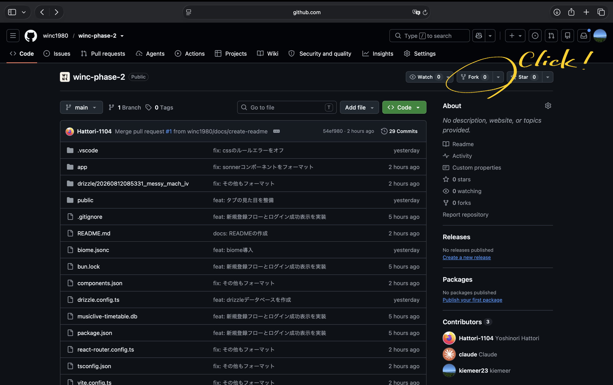
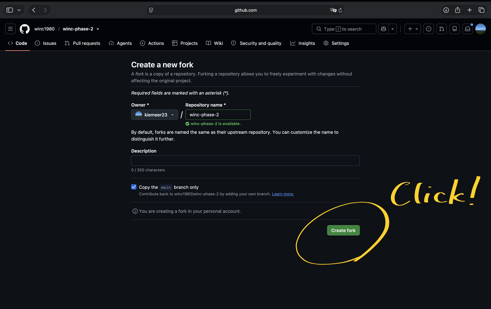
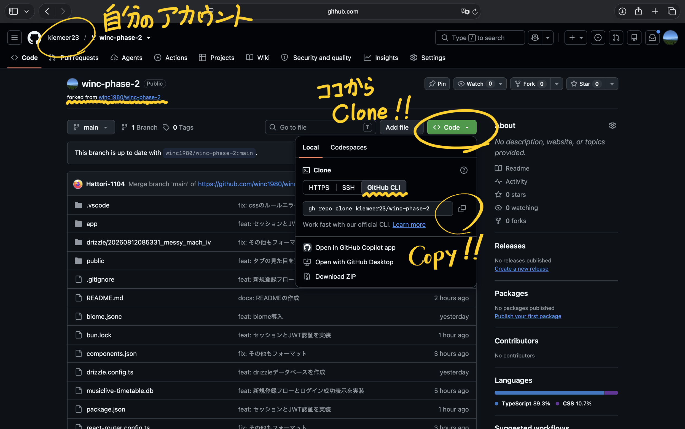
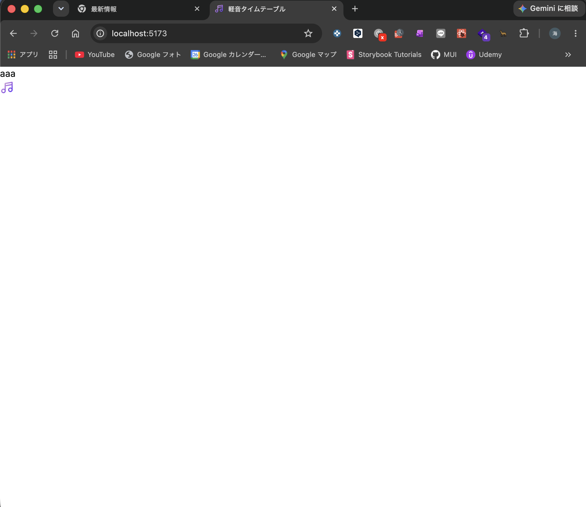

# このドキュメントについて

このドキュメントには、学習用軽音タイムテーブルの環境構築の方法を記載する。学習を始める際や詰まった時に適宜確認すること

# 環境構築

## STEP.1 Bunのインストール

まずBunがPCにインストールされているかを確認する。

```cmd
bun -v
```

```cmd
1.3.14
```

のように出ていたら次のステップに進む。

```cmd
command not found
```

などのエラーが出た場合は["このリンク"](https://bun.com/docs/installation)を参照してBunをインストールする。

※ 注意:**mac** の場合は`curl`コマンドではなく`Homebrew`を使ってインストールする。Bunのインストールガイドでは`Package Managers` -> `Homebrew`の順に選択し、以下のコマンドを実行する。

```cmd
brew install oven-sh/bun/bun
```

※ Homebrewがインストールされていない場合は["このサイト"](https://brew.sh/ja/)を参照しインストールする。

## STEP.2 プロジェクトをフォークする

このリポジトリをみなさんはフォークして使う。

> [!note]
> フォークとは、別の人が所有するレポジトリをコピーして自分のレポジトリとして使用することをいう。





## STEP.3 クローンする

1. 上記画像を参考にGithub CLIコマンドをコピーする。
2. 実行する。

```cmd
 gh repo clone xxx
```

## STEP.4 パッケージをインストールする

1. プロジェクトのルートディレクトに移動する

```cmd
 cd your_path/winc-phase-2
```

2. パッケージをインストールする

```cmd
 bun install
```

3. 必要なコマンドを打つ

```cmd
 bunx drizzle-kit push
```

<details>

<summary>何をしている？</summary>

データベースを扱いやすくするORMを準備しています。

> [!note]
> データベースとは、データを永続的に保存できるもので、代表的なものに`MySQL`,`Postgress`などがあります。今回は`sqlite`を使います。

> [!note]
> Object Relation Mapper。ORMとは、プログラミング言語からデータベースを扱うために使う便利なツール群。SQL文を直接書くより、言語の文法で型安全に書くことができる。

</details>

## STEP.5 開発サーバを起動する

```cmd
 bun dev
```

localhostでサーバが起動する。
ターミナル上のリンクは`Ctrl` + `Click` (Macは`Command` + `Click`)で開ける。

> [!note]
> VSCodeの内部ブラウザではなく、Google Chromeを使用すると良い。`bun dev`を実行したターミナル上で`o`を入力して`enter`すると、Google Chromeで開ける。


